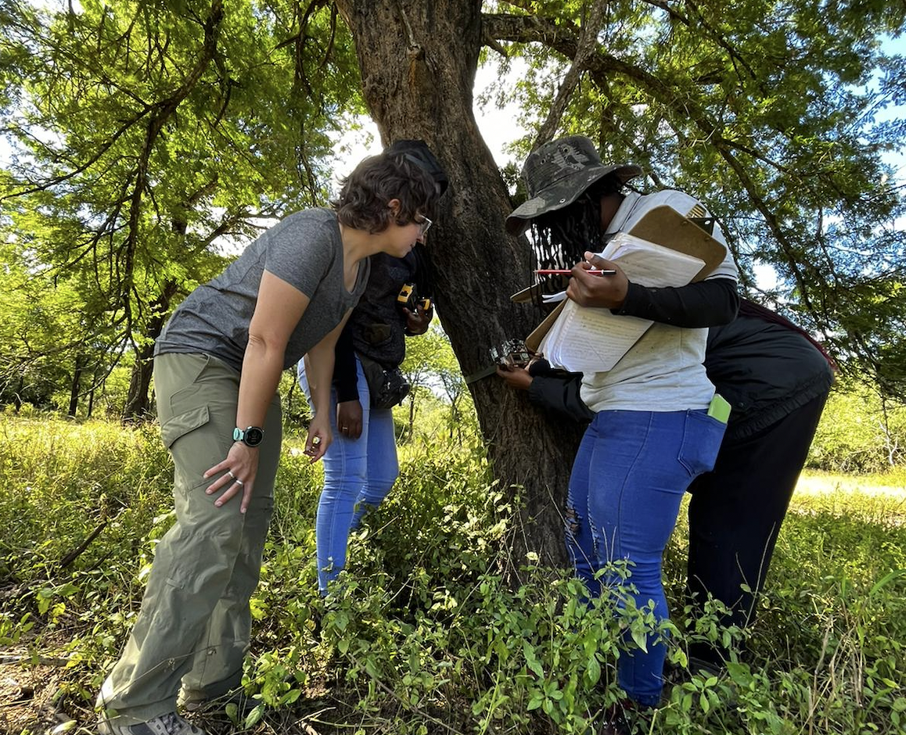

# Fieldwork {#fieldwork}

For some members of the Gaynor Lab, fieldwork will be an important component of research. This page is created to share information and expectations regarding local and international fieldwork, and will grow as our members begin to work in additional field sites. Please update this page with the most recent information as you prepare and complete your field seasons.

## Planning

You will need to carefully plan your fieldwork as part of your overall work plan. Well before embarking on field work you should prepare the following items and/or discuss them with Kaitlyn:

+ Objectives of field work
+ Proposed timing
+ Proposed budget (and sources of funds secured vs. needed). Can include range, e.g. from cheapest to dream budget
+ Permits: are permits required (e.g. from provincial/local governments? First Nations?)
+ Ethics: is an Animal Care or Human Ethics protocol required? (see below)
+ Safety: a field safety plan is required (see below)
+ Are there particular considerations regarding Equity, Diversity and Inclusion (including anti-racism, reconciliation, capacity-building)?

As you are more than likely researching live wild animals (even if through non-invasive techniques) you will need to complete the UBC Animal Care protocols (or be included under an existing one for WildCo) and if you are also including human subjects, you will need to complete the Human Ethics protocol (which may be needed for public privacy in camera trap surveys, participant surveys, or engaging with communities). 

## Field safety

[UBC Student Safety Abroad](https://safetyabroad.ubc.ca/) has some information that is relevant for people traveling abroad for fieldwork. If you are doing international fieldwork, you will need to register with UBC’s [Safety Registry](https://registry.safetyabroad.ubc.ca/). Depending on the country you are going to, there may be additional steps or forms you will need to take or fill out (e.g register with the Canadian government). Be sure to check the government page for travel advisories. The email for Safety Abroad is safety.abroad@ubc.ca. On campus, they are located in the UBC Life Building (1100-6138 Student Union Boulevard). 

Physical and emotional safety is paramount in the field. If you ever feel unsafe, please try to leave the situation and contact Kaitlyn immediately. We'll have a more detailed safety protocol in place here before anybody in the lab begins fieldwork.

The following subsections have information pulled from Kwasi's [Field Safety Presentation](https://docs.google.com/presentation/d/1LBeJHDH1F6p8LtGrihol-EiwhUGJrZLmdykNbifN63g/edit?usp=sharing). You are encouraged to revisit the slideshow, and reflect on what safety in the field means to you.

### Field safety plans

Prior to conducting any field research while affiliated with UBC, you must complete a travel and field safety form to be approved through the Department of Zoology. Kaitlyn has drafted these in the past, and we can build on old versions, so talk to her prior to starting to write a plan.

Generally, while preparing for fieldwork, you should ask and/or know about the following:

- Who and where are your points of contact in case of emergency? This includes people locally (eg. emergency services) as well as back home (eg. partners)
- How will you communicate with teammates, and what are the rules/expectations?
- How will you be transported to and between locations? Be sure to make your itinerary clear.
- What should you expect? What are the risks, protocols, and required training? Again, a clear itinerary is important.
- What are the no-go criteria? In what circumstances will the fieldwork be halted for the day or entirely?
- What are the health related protocols? eg. first-aid kit, people with first-aid certification (see below), required vaccinations, protocols for people needing regular medication/treatment. 

### First aid

All lab members are strongly encouraged to complete a wilderness first aid course prior to their first field season. Coast Wilderness Medical Training offers a 40-hour wilderness first aid course about twice a month. The course is taught in Pacific Spirit Park and can either be taken over two weekends or in 4 consecutive days. Upon completion you will earn a Red Cross Wilderness First Aid certificate with CPR-C. Kaitlyn can cover the expenses of this course.

### Preparing for the field

The following steps will all help with field preparation *and* the actual trip itself.

- Familiarize yourself with your destination. This includes knowing where the nearby towns are, and identifying potential risk factors. 
- Complete training (eg. wilderness first aid) and practice skills (relevant vehicle/equipment use, backpacking, familiarizing yourself with recent research)
- Collect and stock up on your gear and supplies. Know what you'll have access to, and start collecting early in case you have trouble obtaining something. Bring backups!
- Get to know your team!

## Travel insurance & medical care

UBC Health Insurance provides Travel Insurance, however, not all medication is covered (e.g. anti-malarial medication) and most travel vaccines are not covered. For detailed information about what may or may not be covered by your insurance plan, it is recommended that you check out the AMS Student Care website and to directly contact Student Health Services (1-877-795-4421). On campus, the address is AMS/GSS Care Office Room 3128, The Nest Building, 6133 University Boulevard.

If you need medication or vaccines for travel to particular countries you can get these at a travel clinic. There are several located throughout Vancouver and you may need to call ahead for an appointment or to check that the vaccine you need is in stock at the clinic. 

## Animal Care and Use

You need to create an account on [UBC RISe (Research Information Systems)](https://www.rise.ubc.ca/) and complete the [ethics module](https://animalcare.ubc.ca/training/ccac-online-ethics). Talk to Kaitlyn about whether there is an existing ACUC protocol for your research project, to which you can be added, or whether you will need to submit a new one.

## Gorongosa National Park, Mozambique

Some members of the Gaynor Lab will be working in Gorongosa National Park, or Parque Nacional da Gorongosa, in central Mozambique, where Kaitlyn has been working here since 2015. This section of the lab manual will serve to provide guidance and share knowledge about logistics in the park.

### Logistics

As you begin to plan your field season, ask Kaitlyn to put you in touch with the Gorongosa National Park Research Manager, Miguel Lajas. Miguel will share research permit forms and provide a document with the latest information for visiting researchers about accommodation, meals, transport, recommended packing lists, and other logistics. We will also maintain a copy of this document in the Gaynor Lab Google Drive. The information below is meant to supplement the park guide.

#### Travel {-}

You should plan to fly into the Beira airport (BEW). The park will arrange for your transport to Chitengo, the park headquarters, by road (~5 hours) or small aircraft (~30 minutes). If you have >20kg of luggage, your luggage will need to be transferred by road, so let the park know when you arrange for your transfer. You should plan for road transfer in one of your first visits to the park (perhaps on the way home, when you aren't yet so travel-weary!), to better understand the local context.

#### Visas {-}

You may need to obtain a visa at the Mozambican consulate in Canada in advance of your travels. At times, these visas have been issued for 90 days, but lately they are limited to 30, requiring you to leave and re-enter the country from Zimbabwe or South Africa. Sometimes you will be issued a tourist visa, and other times a business visa. In all cases, you should obtain an official letter from Gorongosa National Park inviting you to visit (Miguel can help you with this). 

As of 2023, citizens of certain countries (including the United States) can obtain a visa upon arrival to the Beira airport.

It is your responsibility to make sure you get an appropriate visa and do not overstay it (the fees will be large!) In summary, visa regulations have changed considerably over the years, so ask your labmates and ask Miguel to put you in touch with researchers who have recently navigated the process. And update this manual with your experiences!

#### Equipment {-}

It is very difficult to procure research materials once you are in the field, so bring plenty of anything you think you may need (e.g., flagging tape, Ziploc bags, Sharpies) 

The avenues for purchasing research equipment are as follows:

+ *Through the park's procurement system.* The park uses a consolidator in South Africa, and orders are bundled and shipped to the park via the land border (so allow several months to receive your order). We use this route for purchasing camera traps, batteries, and computers
+ *In your luggage.* You should be prepared to held up by customs officers and asked to pay customs fees (~20%) at the airport. If you plan to fly with equipment, please communicate with Miguel at least a month before your trip (instructions will be in the information he sents), as they may be able to make arrangements in advance with customs officials in Beira. Note that there have been a couple of instances of luggage containing expensive equipment mysteriously disappearing during transfer in JNB, so take care.
+ *Shipments via DHL.* This may take a very long time, and may get held up at customs, so is the least desirable option.

You may store research equipment in the visiting researcher storage room at the lab in Chitengo, within reason. Please label all equipment, and keep an inventory of everything that you leave behind in the Gaynor Lab Google Drive folder so that we can keep track of what we have in the field.

#### Travel preparation {-}

Ensure that you are up-to-date with recommended vaccinations and plan to get a prescription for malaria prophylaxis. 

You may be able to purchase and activate an eSIM card for Mozambique in advance of your travels (e.g., using the Airalo app). You may also be able to get a physical SIM card, and if you go this route, Movitel has the best coverage in the park. 

Wireless Internet speeds are adequate in Chitengo for most purposes, although you should be prepared for unexpected outages and slow-downs, particularly in the evenings when more people are streaming and video calling. Social media is blocked during the day, to facilitate work. 

ATMs in the Beira airport are the easiest way to draw Mozambican currency (meticais). Millenium Bank in Vila Gorongosa has ATMs where international debit cards work, and US Dollars, Rand, and Euros can be exchanged in Beira and Chimoio. Alert your bank ahead of travel so that your account is not frozen for suspicious activity.

### Field safety

#### Preparing for the field {-}

- Whenever you leave the park, you must write down your planned route on the whiteboard in the science building.
- The gates around Chitengo are closed from dusk to dawn. You need to communicate with the Research Manager if you’d like to be out during this period (for stargazing, late for a sundowner, early morning fieldwork, etc).
- It is a good general practice to make a checklist of essential items needed for fieldwork, and check that you have all of them every single morning before leaving camp
- Always carry a first aid kit with you in the field.
- Always carry a radio and Garmin InReach with you when you go into the field.
- On a daily basis, confirm you have everything that should be in the car - winch remotes, tire jack, recovery rope.
- It is crucial to bring enough water: bring more than you think you need, keep extra water in the truck. Same with food: bring snacks every day and keep some in the truck. If you are planning to be far from camp, consider bringing lunch for your group (including the ranger) so that there’s no risk of missing lunch
- Many plants have thorns, so it’s a good idea to have appropriate footwear (thick soled hiking boots), long socks, long pants and long sleeves
- Wear sunscreen, hats, and sunglasses to protect from the sun.

#### In the field {-}

- First and foremost, follow the ranger's guidance and recommendations. But also remember that they are humans, and you need to also rely on your own common sense. If something feels risky at any point, communicate that to the group, and we will not do it. No field tasks are worth putting safety at risk
- Do not do any fieldwork that requires leaving the vehicle without a ranger. If a ranger isn’t available that day, plan to work on activities in camp or from the vehicle.
- Never drive alone.
- Be on the lookout for snakes while hiking. They are not common, but there are several extremely venomous species, including mambas and cobras.
- When walking in the field, always be looking and listening for wildlife. Do not count on others for this. Watch where you step!
- Always stay within eyesight of others when in the field.
- Remember where you left your vehicle. If you parked off-road, take a waypoint on your GPS device so that you can navigate back to it. Do not count on the ranger to remember—emergencies happen, and rangers sometimes (rarely) get lost.
- Car keys should be kept in the driver’s backpack in a zipped pocket or clipped inside bag. Be sure that everyone in your party knows where the car keys are.

#### Communication {-}

- Download the Gaia GPS app on your phone. It’s very useful for navigation and data recording, but not for contacting people in emergencies.
- If you have an eSIM, you will likely have service in some parts of the park, but not others, so it can be helpful but is not sufficient. Similarly, the rangers have phones with service in some areas of the park.
- Radios are stored in the Research Manager office. Channel 8 is science and channel 16 is simplex. We are currently using 16 for all park communication. Only researchers and command room can hear science. Everyone (including tourism) can hear simplex. Command room hears all communications but doesn’t respond unless directly addressed. Say dois zero um (201) to speak to command room. To speak to an individual person, hold button on left, wait a beat, then say “Name, name, name, do you copy?” If you need emergency help, say “all stations” or “command room 201”
- We have a Garmin inReach Mini which allows for SMS communication via satellite. It is kept in Sofia’s field bag. You can send a set of preset messages (or customized messages with a character count). Test functionality monthly. Contact Research Manager (Dadzie Tarua in 2026 at +258 875901507). Download Garmin messenger app and connect to account

#### In Chitengo {-}

- Make sure to have a flashlight/cell phone with you for walking around at night, and it is usually a good idea to have a buddy with you (lions in Chitengo are not uncommon)
- Tap water in Chitengo is potable.
- Malaria is prevalent in the area, so take malaria prophylaxis.
- Keep your cabin locked at all times to prevent baboons from entering.
- Be vigilant of baboons when walking around, and do not walk with food visibly in your hands if there are baboons around.

### Field vehicle

Our lab field vehicle is a Toyota Land Cruiser. To drive, you will need to have a driver’s license, be comfortable driving a 4WD manual right-side-drive vehicle in muddy and rugged conditions with unpredictable wildlife, and to know the basics of changing a tyre and checking fluids. You can learn some of these skills in the field as needed (Kaitlyn did!) and will need to demonstrate your driving abilities to Scientific Services staff prior to being cleared to drive on your own. 

#### Vehicle safety {-}

- Ensure regular maintenance of the vehicle. The mechanics in Chitengo are fantastic and very helpful.
- Upon arrival, request a lesson from Research Manager for changing tires and using the winch.

#### Using the winch {-}

- Leave the car on (but note that it uses battery and will drain your battery eventually).
- Attach the black cord with 4 metal prongs to the outlet on the front, on the bull bar (above the first A on the license plate)
- Turn up the revs of the engine (on the left side of the steering wheel) when you're using the winch
- Use the remote: "out" loosens the cord and lets you pull it out
- Wrap the winch carabineer around the tree or whatever you're using to pull yourself out. Make sure the tree is strong enough to pull you out. Make sure the black cord isn't wrapped around the blue winch rope
- Release the parking brake before starting to use the winch. Then press "in" to pull the car forward.
- Loosen the blue rope to be able to unwrap it from the tree - using "out"
- Wrap the cord back up, with one person holding it to guide it back on neatly. You need to go slowly at the end to make sure you can attach the carabineer back to the holder
- We have a wireless remote as well as another option - use this first to avoid wrapping cord and rope together. This will eventually die

#### Using the tow rope {-}

- Attach the big silver ring with the red bolt to the red hooking point on the vehicle, on the passenger side (below the F on the license plate). Don't fully screw it right, or it won't come undone after you've done your work
- Make sure the recovery rope is in the hook.
- The orange rope is then your attachment to the other car - use the other ring.
- Hooking points are usually red.

#### Four wheel drive {-}

- You will normally be in high 2. Front wheels don't have traction, they're just spinning.
- High 4 engages all four wheels. It useful for sand (Low 4 will be too slow for sand)
- Low 4 and first gear is the go-to when you're in mud (this is adjusted using the lever next to the gear shifter). Low is the most powerful gear you have - you try this before you use the winch. For steep and rocky terrain, use low 4 in second gear 

#### Tire change {-}

- Get the spare tire out first, so you're not climbing in the back with the jack under the car.
The jack is attached in the passenger backseat. You need to loosen it to get it out (it should be tight when driving to not be noisy).
- Make sure the parking brake is on, and you have something in front of one of the tires - think about where the car might fall.
- Use a tire wrench to loosen the bolts first - don't loosen them around the circle, do one and then do the one across from it, and so on. (Also make sure you tighten everything together at the end.) Don’t remove the bolts before you lift the tire.
- Assemble the two-part rod with a hook on the end for raising the jack. There's also a handle to attach to make it easier to spin.
- Place the jack somewhere flat and metal. You can feel with your hand to find a good spot - Miguel put it on the inside of the tire, in between (front and back) the springs (when we were thinking about replacing a back tire). Don't put the jack on the springs
- Lift the vehicle up with the jack (clockwise to lift), with some room to spare so you can easily manipulate the tire
- Remove the tire and replace with the spare tire.
- After resting the tire in place, you can spin the tire to get the holes in the right spot
- Tighten the bolts with your hand first, then with the tool.
- Lower the vehicle back down and remove the jack.

### Expectations of engagement

All lab members should be prepared for respectful, challenging, and important conversations about parachute/helicopter science and the colonial legacies of conservation and research in Africa. Through these conversations and associated actions, we can continue to learn from each other and our colleagues in Mozambique about how to best engage.

#### Learning Portuguese {-}

All lab members working in Mozambique should learn to speak Portuguese conversationally. You can get by at the field station with English, but knowledge of elementary Portuguese will facilitate engagement of local interns, students, and park staff in your research. You will be supported in your efforts to learn Portuguese through coursework at UBC or external courses, and we will practice our language skills as a lab! 

#### Local partnerships {-}

All members of the Gaynor Lab should plan to partner with Mozambican researchers in the course of their research, both in PNG and beyond. For PhD students, you should expect to have a conversation with Kaitlyn and the Gorongosa MSc program director about how you might co-develop your thesis research alongside a Mozambican MSc student. Such a partnership will have many co-benefits in terms of sharing resources, data, skills, ideas, and perspectives. For all lab members, inquire about opportunities to work with interns in the EO Wilson lab during your fieldwork, or to hire local high school graduates. For more advanced lab members, consider co-teaching a workshop or MSc course, either with Kaitlyn or other instructors.

#### Exploring the context {-}

The research station at Chitengo can feel isolated from the surrounding community context. All lab members are encouraged and expected to seek out opportunities to get out of the park and meet the people living in and around it. This may come at the expense of data collection, but it will provide important perspective and a much-needed break from the field station bubble. Go to the market in Vila, get a ride to the Shoprite in Chimoio, go home for a weekend with your Mozambican colleagues, visit the mountain, sit in on activities at the CEC, take the boat to Vinho, and opt for a road transfer from Beira rather than air transfer in one of your first field seasons. Close partnership with Mozambican researchers and knowledge of Portuguese will facilitate this type of exploration (see above). 

