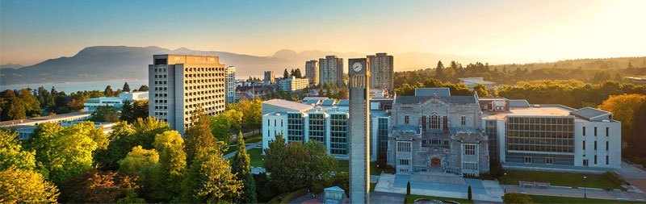

# UBC logistics {#ubc}

The lab just started up in 2022, and there's a lot to learn about how things work at UBC. Be patient as we figure this out together 🙂 More information will go here as we learn!

## Office space

The Gaynor Lab will eventually be based in the Biodiversity Research Centre, after the construction of the new wing. 

For the next few years, we will have access to interim space in Ponderosa E (BRC swing space, where Kaitlyn's office will be located), Lower Mall Research Station (IBioS office), and other Zoology & Botany buildings (Biological Sciences, BRC). These buildings are all within a 5-10 minute walk of each other.

We may be a bit scattered, but all graduate students and postdocs will have a designated desk in an office shared with others in the department and/or IBioS. Kaitlyn will work with everybody to make sure you are happy with your office arrangement.

We will be sure to schedule regular lab gatherings to make sure we see each other until we're all housed in the same building.

## Computing

The [Zoology Computing Unit](https://zcu.zoology.ubc.ca:442/wiki/index.php/Main_Page) has a lot of great information on its Wikipedia page, about how to set up your UBC e-mail and use the Zoology computing resources.

## Finance

We will use the [Workday](https://hr.ubc.ca/working-ubc/welcome-workday) platform for procurement and reimbursement. 

We have a lab credit card for research-related purposes. Please discuss use of the credit card with Kaitlyn.

## Life in Vancouver

We can use this space to share resources on housing, transportation, etc. in Vancouver.

### Housing

**Off-campus housing:** Facebook, Craigslist, PadMapper, RentCafe and more exist to find off-campus housing. The Facebook groups "UBC students looking for roommates, housing rental/sublet" and "UBC Graduate Student Housing Group" are especially popular and useful for finding roommates. 

**On-campus housing:** You can find an overview of on-campus housing [here](https://vancouver.housing.ubc.ca/residences-rooms/residences/). UBC has two [graduate student housing options](https://www.grad.ubc.ca/campus-community/residential-graduate-colleges) as well that include meal plans. On-campus housing tends to have a long wait list, so if you are interested, apply as soon as you can. 

### Transportation

**Public transportation:** As apart of your student fees at UBC, you will be enrolled in the U-Pass program. After you link your U-Pass account to a Compass card, you will have unlimited access to buses, Skytrains and the Seabus. 

You can find more information on transportation around Vancouver [here](https://www.grad.ubc.ca/campus-community/life-vancouver/transportation)
